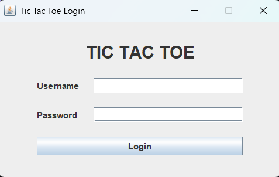
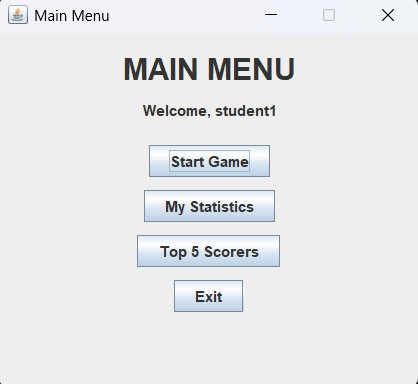
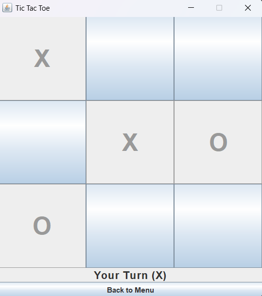
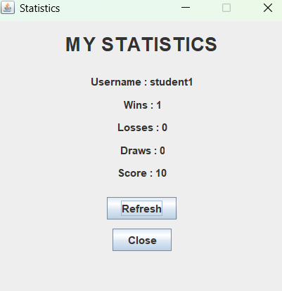
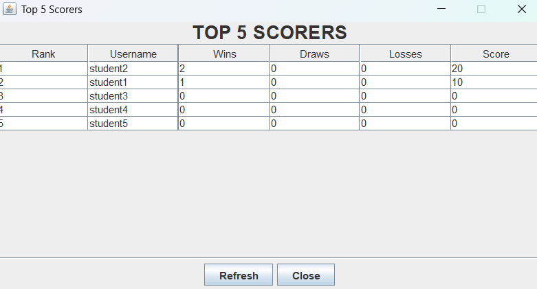

# Simple Tic-Tac-Toe Game with Java Swing, Login, and Statistics

## Student Information

**Name:**  
Marevo Devansyah Sigit

**NRP:**  
5026251091

**Class:**  
A

---

## Deskripsi Project

Project ini merupakan permainan **Tic-Tac-Toe** berbasis **Java Swing** yang dilengkapi dengan fitur login, pencatatan statistik permainan, dan leaderboard Top 5 pemain. Data pemain disimpan menggunakan database PostgreSQL melalui JDBC.

---

## Fitur

- Login menggunakan database PostgreSQL
- Bermain Tic-Tac-Toe melawan komputer
- Menyimpan statistik (Win, Lose, Draw)
- Menampilkan statistik pemain
- Menampilkan Top 5 pemain berdasarkan skor

---

## Database

**Database yang digunakan:** PostgreSQL

---

## Cara Menjalankan Program

1. Buat database PostgreSQL.
2. Buat tabel `players`.
3. Tambahkan data pemain.
4. Letakkan file JDBC PostgreSQL (`.jar`) pada folder `lib`.
5. Atur konfigurasi database pada `DatabaseManager.java`.
6. Jalankan `Main.java`.

---

## Penjelasan Class

**Main**  
Sebagai titik awal program.

**DatabaseManager**  
Mengelola koneksi ke database PostgreSQL.

**Player**  
Menyimpan data pemain.

**PlayerService**  
Mengelola proses login dan operasi database.

**GameLogic**  
Berisi logika permainan Tic-Tac-Toe.

**LoginFrame**  
Menampilkan halaman login.

**MainMenuFrame**  
Menampilkan menu utama aplikasi.

**GameFrame**  
Menampilkan papan permainan dan mengatur jalannya permainan.

**StatisticsFrame**  
Menampilkan statistik pemain yang sedang login.

**TopScorersFrame**  
Menampilkan 5 pemain dengan skor tertinggi.

---

## Screenshot

### 1. Login

### 2. Main Menu

### 3. Game

### 4. Statistics

### 5. Top Scorers

---

## Video Presentasi

YouTube:
(https://youtu.be/8KckiKXD93Q)
